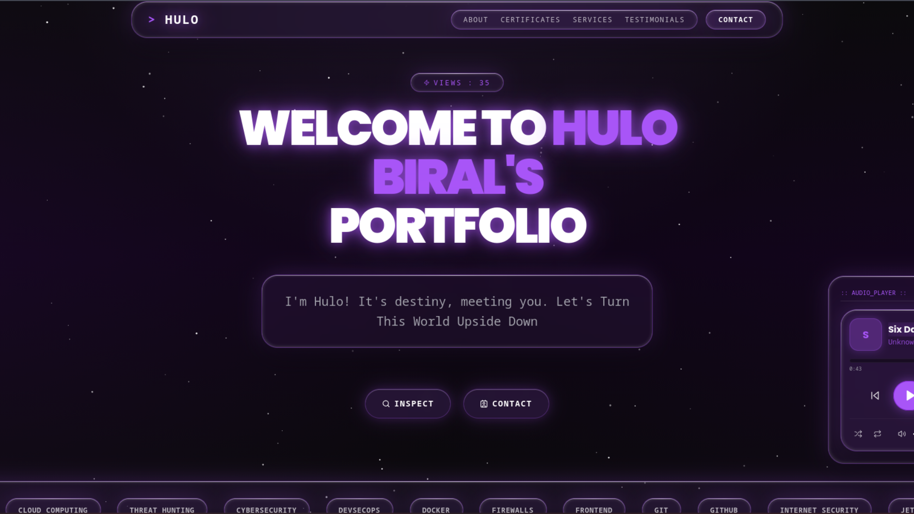

# 🛡️ Hulo Biral | The Great Cyber Era



<div align="center">

[](https://nextjs.org/)
[](https://react.dev/)
[](https://www.typescriptlang.org/)
[](https://tailwindcss.com/)
[](https://vercel.com/)

</div>

<p align="center">
  <strong>"I'm Hulo! It's destiny, meeting you. Let's Turn This World Upside Down."</strong>
</p>

## ⚡ Overview

**Hulo's Portfolio** is a high-performance, cybersecurity-themed personal website built with the bleeding edge of web technology. It serves as a digital "Arsenal," showcasing skills in offensive/defensive security, web development, and content creation.

The design philosophy merges a **dark, void-like aesthetic** with luxurious purple neon accents, glassmorphism, and interactive elements inspired by hacker culture and anime influences.

## 🚀 Key Features

* **Cyber-Aesthetic UI:** Deep void backgrounds with `oklch` color spaces, purple glows, and glassmorphic cards.
* **Interactive Terminal:** A CLI-style "About Me" section (`root@hulo:~#`) rendering bio and stories.
* **Music Player:** Integrated global audio player with a custom playlist.
* **Certificate Vault:** A dedicated section displaying verified credentials from Cisco, ISC2, Google, and more.
* **The Arsenal (Hall of Fame):** A showcase of cybersecurity tools used (Nmap, Burp Suite) and custom tools created.
* **Smooth Experience:** Implemented `lenis` for buttery smooth scrolling and `framer-motion` for animations.
* **Dynamic Stats:** Real-time view counter powered by `counterapi`.
* **Particle Effects:** Custom HTML5 Canvas particle background system.

## 🛠️ Tech Stack

This project uses the latest modern web stack:

-   **Framework:** [Next.js 16](https://nextjs.org/) (App Router)
-   **Core:** React 19
-   **Styling:** Tailwind CSS v4 (Alpha/Beta), PostCSS
-   **Icons:** Lucide React
-   **Animations:** Framer Motion, Lenis Scroll, Tailwind Animate
-   **UI Components:** Radix UI primitives, Shadcn/ui patterns
-   **Font:** Geist Mono & Poppins
-   **Package Manager:** pnpm

## 📂 Project Structure

```bash

├── app
│   ├── api
│   │   └── counter
│   │       └── route.ts
│   ├── globals.css
│   ├── layout.tsx
│   └── page.tsx
├── components
│   ├── about.tsx
│   ├── certificates.tsx
│   ├── cta.tsx
│   ├── footer.tsx
│   ├── hallOfFame.tsx
│   ├── header.tsx
│   ├── hero.tsx
│   ├── HeroWrapper.tsx
│   ├── imageGallery.tsx
│   ├── musicPlayer.tsx
│   ├── particle-background.tsx
│   ├── quote.tsx
│   ├── services.tsx
│   ├── smooth-scroll.tsx
│   ├── tech-banner.tsx
│   ├── testimonials.tsx
│   └── theme-provider.tsx
├── components.json
├── improvements.txt
├── lib
│   └── utils.ts
├── next.config.mjs
├── next-env.d.ts
├── package.json
├── pnpm-lock.yaml
├── postcss.config.mjs
├── public
│   ├── apple-icon.png
│   ├── build-a-website-on-google-cloud-skill-badge.png
│   ├── Crystal Castles - Crimewave (slowed + reverb) [gFmC6M0aeP8].mp3
│   ├── hacktoberfest-6th-pr-accepted-hulo-biral-cyber.webp
│   ├── hulo-biral-cyber-security-alone.jpg
│   ├── hulo-biral-cyber-security-arrofant-goku-black.jpg
│   ├── hulo-biral-cyber-security-ben-10-funny.jpeg
│   ├── hulo-biral-cyber-security-ben-10-smoothie.jpeg
│   ├── hulo-biral-cyber-security-eminem-glow.jpeg
│   ├── hulo-biral-cyber-security-eminem.jpg
│   ├── hulo-biral-cyber-security-favourite-anime-character.jpeg
│   ├── hulo-biral-cyber-security-goku-black.jpg
│   ├── hulo-biral-cyber-security-goku-black-smile.jpeg
│   ├── hulo-biral-cyber-security-great-cyber-era.jpg
│   ├── hulo-biral-cyber-security-griffith.jpg
│   ├── hulo-biral-cyber-security-griffith-pfp.png
│   ├── hulo-biral-cyber-security-idols.jpg
│   ├── hulo-biral-cyber-security-kid-goku-smile.jpeg
│   ├── hulo-biral-cyber-security-logo.jpg
│   ├── hulo-biral-cyber-security-meaningless-huhh.jpg
│   ├── hulo-biral-cyber-security-original-face.jpg
│   ├── hulo-biral-cyber-security-pfp.jpeg
│   ├── hulo-biral-cyber-security-ssj-rose.jpeg
│   ├── hulo-biral-cyber-security-transition-i-need.jpeg
│   ├── hulo-biral-cyber-security-work.jpg
│   ├── hulo-biral-ec-council-darkweb.png
│   ├── icon-dark-32x32.png
│   ├── icon-light-32x32.png
│   ├── icon.svg
│   ├── images - 2025-10-29T005924.699.jpeg
│   ├── introduction-to-cybersecurity-cisco-completed-by-hulo-biral.png
│   ├── isc2-candidate-hulo-biral.png
│   ├── og-image-hulo-biral-cyber-security.jpg
│   ├── placeholder.jpg
│   ├── placeholder-logo.png
│   ├── placeholder-logo.svg
│   ├── placeholder.svg
│   ├── placeholder-user.jpg
│   ├── robots.txt
│   ├── sitemap.xml
│   ├── Six_Days__Remix_(256k).mp3
│   └── tryhackme-hulo-biral-bronze-league-1st.svg
├── README.md
├── styles
│   └── globals.css
└── tsconfig.json             # Utility functions
````

## ⚡ Getting Started

To run this project locally, ensure you have **Node.js** installed.

1.  **Clone the repository:**

    ```bash
    git clone https://github.com/hul0/monochrome-portfolio.git
    cd monochrome-portfolio
    ```

2.  **Install dependencies (using pnpm):**

    ```bash
    pnpm install
    ```

3.  **Set up Environment Variables:**
    Create a `.env.local` file in the root directory:

    ```env
    # For the view counter functionality
    COUNTER_API_KEY=your_counter_api_key
    NEXT_PUBLIC_SITE_URL=http://localhost:3000
    ```

4.  **Run the development server:**

    ```bash
    pnpm run dev
    ```

5.  Open [http://localhost:3000](https://www.google.com/search?q=http://localhost:3000) with your browser.

## 🎨 Customization Highlights

### The Theme (`globals.css`)

The site uses CSS variables for a "Void & Purple" theme.

```css
:root {
  --background: #0a0a0a;
  --primary: #a855f7; /* Purple 500 */
  --border: rgba(168, 85, 247, 0.25);
}
```

### The Music Player

Located in `components/musicPlayer.tsx`. To change tracks, modify the `demoPlaylist` array in `components/hero.tsx`.

## 🤝 Contributing

Contributions are what make the open-source community such an amazing place to learn, inspire, and create. Any contributions you make are **greatly appreciated**.

1.  Fork the Project
2.  Create your Feature Branch (`git checkout -b feature/AmazingFeature`)
3.  Commit your Changes (`git commit -m 'Add some AmazingFeature'`)
4.  Push to the Branch (`git push origin feature/AmazingFeature`)
5.  Open a Pull Request

## 📜 License

Distributed under the MIT License. See `LICENSE` for more information.

## 🌟 Acknowledgements

  * **Icons:** [Lucide](https://lucide.dev)
  * **Design Inspiration:** The Cyber Era & One Piece
  * **Badges:** [Shields.io](https://shields.io)

-----